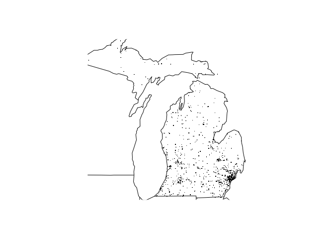

<!-- README.md is generated from README.Rmd. Please edit that file -->
msdr3pam
========

The goal of msdr3pam is to enable the user to read, summarize, plot, and otherwise work with data regarding fatal injuries suffered in motor vehicle accidents in the US. The source of the data is the Fatality Analysis Reporting System (FARS) of the US National Highway Traffic Safety Administration and it can be accessed at the [FARS website](https://www.nhtsa.gov/research-data/fatality-analysis-reporting-system-fars).

The raw data provided by FARS is contained in csv files that include a ".bz2" extension reflecting bzip2 compression. Several sample data files are included in the package to provide application examples and testing. These sample raw data files can be accessed as follows: system.file("extdata","accident\_yyyy.csv.bz2",package="msdrpam"), where yyyy is either 2013, 2014, or 2015. For other years you will have to download the data yourself from the [FARS website](https://www.nhtsa.gov/research-data/fatality-analysis-reporting-system-fars).

The name of the package reflectst the conditions under which it was developed. In particular, it was developed for an assignment for Course 3 of the "Mastering Software Development in R" Specialization on Coursera (msdr3), offered by Johns Hopkins University. In particular, this is the R package assignment (pa) developed by student Miesch (m).

Example
-------

Here is an example of how to summarize the traffic fatalities in three selected years:

``` r
library(msdr3pam)
dir <- system.file("extdata",package="msdr3pam")
fars_summarize_years(c(2013,2014,2015),dir=dir)
```

    ## # A tibble: 12 x 4
    ##    MONTH `2013` `2014` `2015`
    ##  * <int>  <int>  <int>  <int>
    ##  1     1   2230   2168   2368
    ##  2     2   1952   1893   1968
    ##  3     3   2356   2245   2385
    ##  4     4   2300   2308   2430
    ##  5     5   2532   2596   2847
    ##  6     6   2692   2583   2765
    ##  7     7   2660   2696   2998
    ##  8     8   2899   2800   3016
    ##  9     9   2741   2618   2865
    ## 10    10   2768   2831   3019
    ## 11    11   2615   2714   2724
    ## 12    12   2457   2604   2781

And here is an example of how to map out the locations of fatal accidents in a particular year for a particular state (in this case state number 26, which is Michigan)

``` r
fars_map_state(26,2013,dir=dir)
```



To load the raw data for a particular year (in this case 2014) into your R session as a tibble data frame, type

``` r
df <- fars_read(make_filename(2014,dir=dir))
head(df)
```

    ## # A tibble: 6 x 50
    ##   STATE ST_CASE VE_TOTAL VE_FORMS PVH_INVL  PEDS PERNOTMVIT PERMVIT
    ##   <int>   <int>    <int>    <int>    <int> <int>      <int>   <int>
    ## 1     1   10001        1        1        0     0          0       2
    ## 2     1   10002        1        1        0     0          0       1
    ## 3     1   10003        2        2        0     0          0       7
    ## 4     1   10004        3        3        0     0          0       5
    ## 5     1   10005        1        1        0     0          0       1
    ## 6     1   10006        1        1        0     0          0       1
    ## # ... with 42 more variables: PERSONS <int>, COUNTY <int>, CITY <int>,
    ## #   DAY <int>, MONTH <int>, YEAR <int>, DAY_WEEK <int>, HOUR <int>,
    ## #   MINUTE <int>, NHS <int>, ROAD_FNC <int>, ROUTE <int>, TWAY_ID <chr>,
    ## #   TWAY_ID2 <chr>, MILEPT <int>, LATITUDE <dbl>, LONGITUD <dbl>,
    ## #   SP_JUR <int>, HARM_EV <int>, MAN_COLL <int>, RELJCT1 <int>,
    ## #   RELJCT2 <int>, TYP_INT <int>, WRK_ZONE <int>, REL_ROAD <int>,
    ## #   LGT_COND <int>, WEATHER1 <int>, WEATHER2 <int>, WEATHER <int>,
    ## #   SCH_BUS <int>, RAIL <chr>, NOT_HOUR <int>, NOT_MIN <int>,
    ## #   ARR_HOUR <int>, ARR_MIN <int>, HOSP_HR <int>, HOSP_MN <int>,
    ## #   CF1 <int>, CF2 <int>, CF3 <int>, FATALS <int>, DRUNK_DR <int>
